# PKM v1 `devin/pkm-v1-search-ai` — Round 0.9 End-to-End Test Report

**Branch under test:** `devin/pkm-v1-search-ai`  
**Tester:** Devin  
**Date:** 2026-08-11  
**Commit tested:** `origin/devin/pkm-v1-search-ai` (latest at test start)  
**Local stack:**
- Docker Compose: Postgres, Redis, MinIO, Temporal
- API: `pnpm --filter @pkm/api start` → http://localhost:4000
- AI service: `EMBEDDING_PROVIDER=sentence-transformers .venv/bin/python -m uvicorn apps.ai.src.main:app` → http://localhost:8000
- Web: `pnpm --filter @pkm/web dev` → http://localhost:3000

## Summary

The `devin/pkm-v1-search-ai` branch passes the full golden-path end-to-end test suite. All 12 browser steps, health checks, and API/curl verification flows completed successfully. Semantic search (`cat`, `animals`), wikilink autocomplete, backlinks/unlinked mentions, the graph view, note CRUD, OKF round-trip, attachments, and logout/re-login all behaved as expected.

## Verdict

**PASS** — The branch is ready to merge or promote, contingent on the minor blockers noted below.

## Setup

1. Checked out `origin/devin/pkm-v1-search-ai` and created test report branch `devin/pkm-v1-tester-round-0-9`.
2. Started Docker Compose: `docker compose up -d --wait` — all services healthy.
3. Built packages: `pnpm -r build` — successful.
4. Started API, AI service, and web dev servers.
5. Verified health endpoints:
   - `curl http://localhost:8000/health` → `{"status":"ok","version":"0.1.0"}`
   - `curl http://localhost:4000/health` → `{"status":"ok","version":"0.1.0"}`
   - `curl -I http://localhost:3000` → HTTP 200

## Browser Golden Path Results

| Step | Description | Result | Notes |
|---|---|---|---|
| 1 | Register a new user | **PASS** | Redirected to `/` and workspace list shown. |
| 2 | Create a workspace | **PASS** | `Golden Path WS` created and opened. |
| 3 | Create, edit, save notes | **PASS** | Created `animals.md`, `cats.md`, `dogs.md`; preview rendered correctly. |
| 4 | `[[` wikilink autocomplete | **PASS** | `[[anim` showed `animals.md` candidate and inserted a wikilink. |
| 5 | Backlinks and unlinked mentions | **PASS** | `animals.md` listed `cats.md` backlink; unlinked mentions surfaced related notes. |
| 6 | Tags, outline, graph | **PASS** | Frontmatter tags, body tag (`#feline`), outline heading, and graph (`3 notes · 1 links`) all rendered. |
| 7 | Search (including semantic) | **PASS** | `cat` and `animals` queries returned `cats.md`, `dogs.md`, `animals.md`. |
| 8 | Index status panel | **PASS** | `3 note(s), 3 indexed, 3 current, 6 chunks, 6 embedded`. |
| 9 | Duplicate / archive / restore | **PASS** | `cats (copy).md` duplicated, archived, hidden, then restored. |
| 10 | OKF export / import | **PASS** | Export v0.2 round-tripped wikilinks; `birds.md` imported and visible. |
| 11 | Upload and view an attachment | **PASS** | `test-attach.txt` uploaded, listed, downloaded; content matched. |
| 12 | Logout and re-login | **PASS** | Redirected to `/login`; re-login returned to `/` with workspace still listed. |

## Key Screenshots

| View | Screenshot |
|---|---|
| Login form after logout | 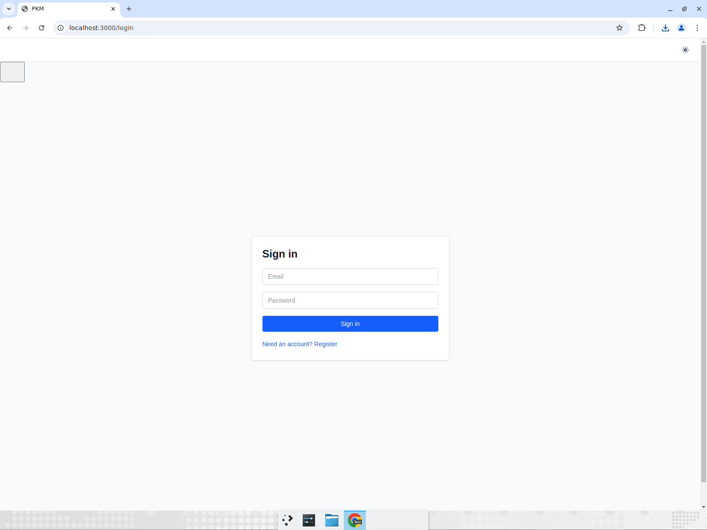 |
| Re-login with credentials | 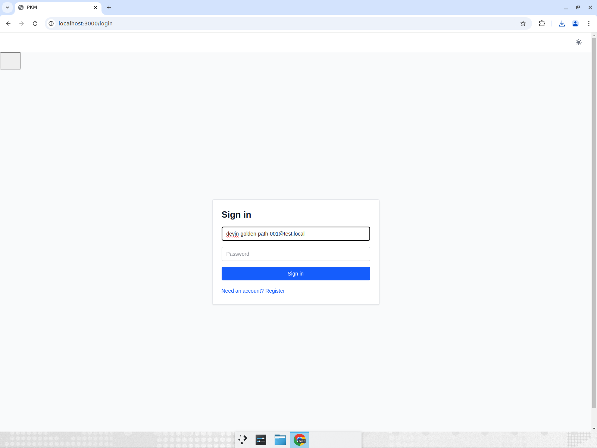 |
| Workspace list after re-login | 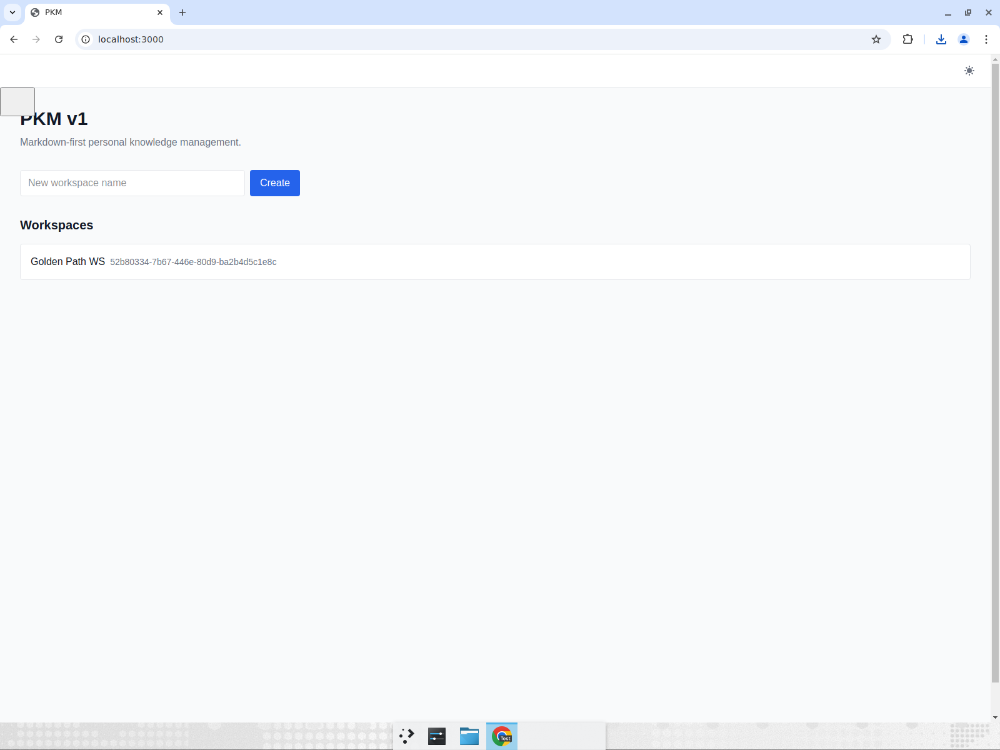 |
| `cats.md` with `[[` wikilink autocomplete | 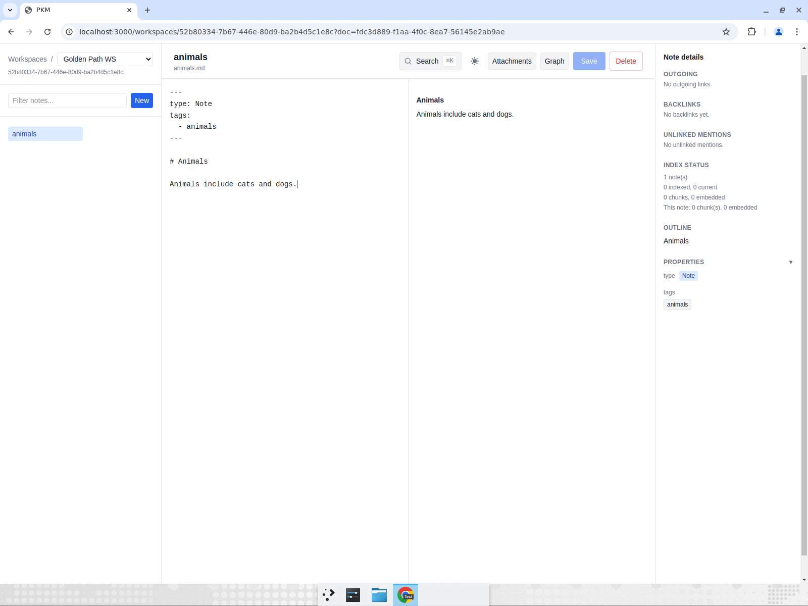 |
| `animals.md` — backlinks, tags, outline, index status | 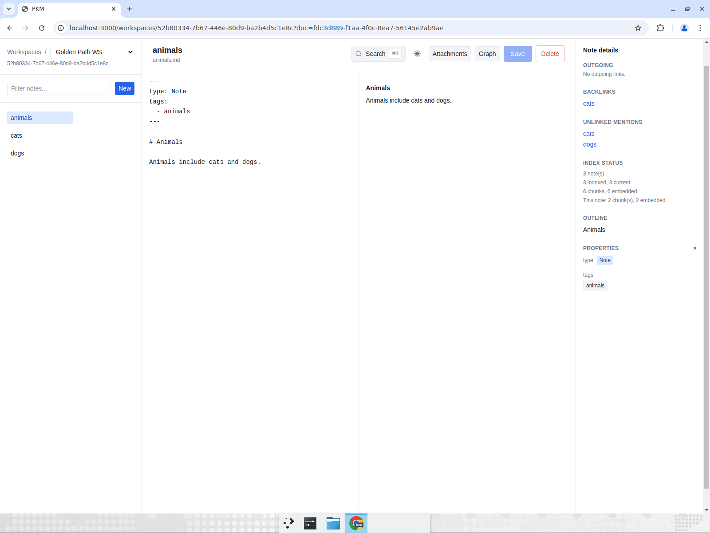 |
| Graph view | 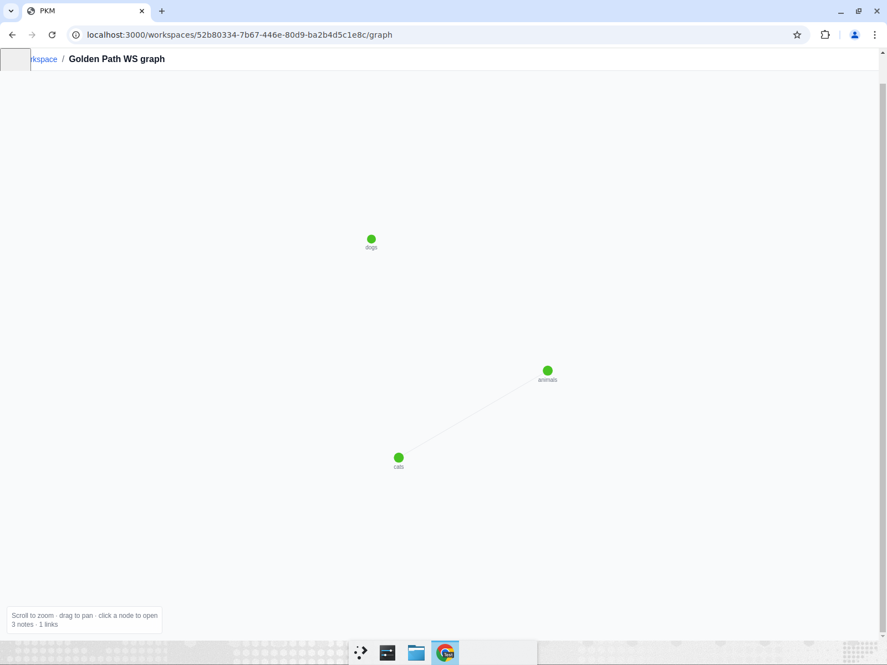 |
| Search palette with `animals` query | 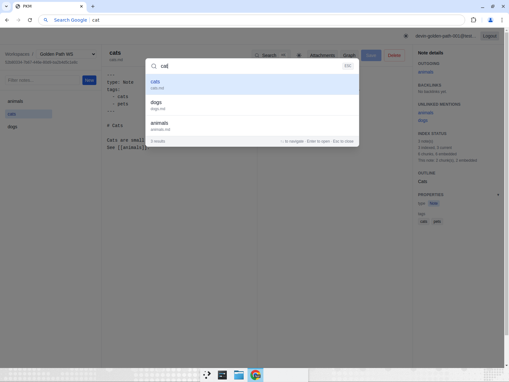 |
| Duplicated `cats (copy)` | 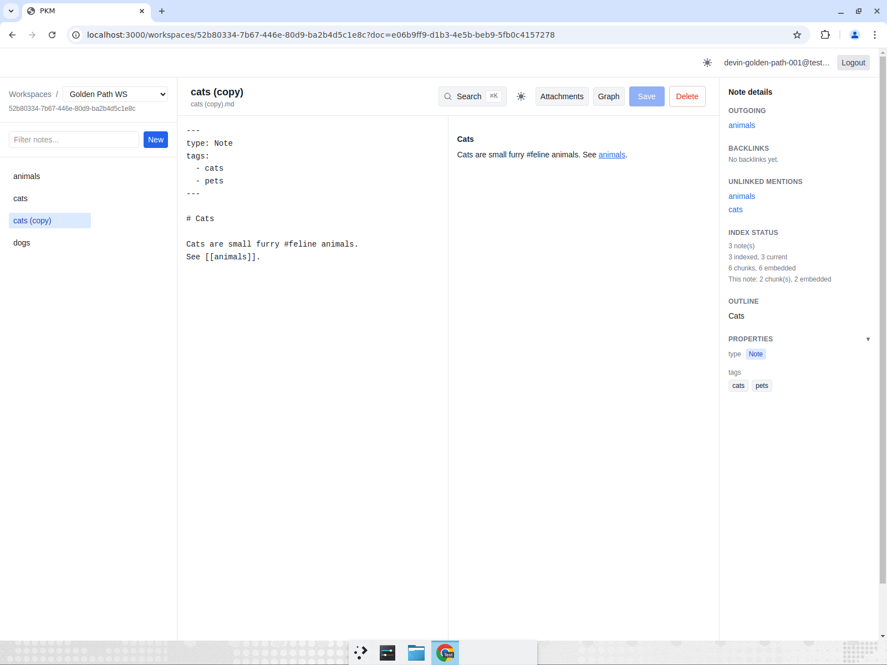 |
| Show archived / restore | 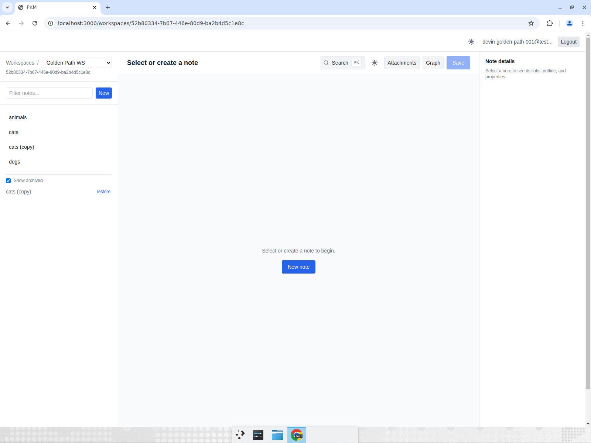 |
| Workspace after OKF import of `birds.md` | 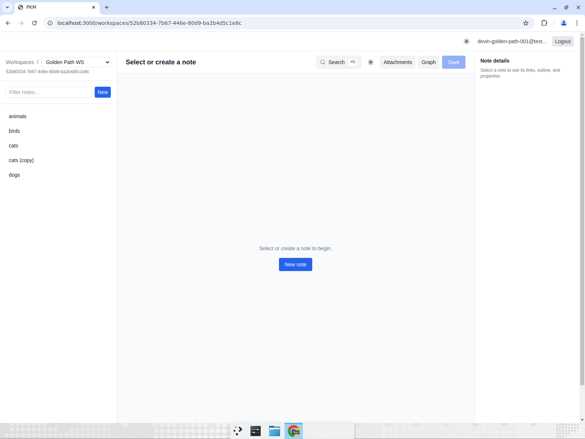 |
| Attachments page after upload | 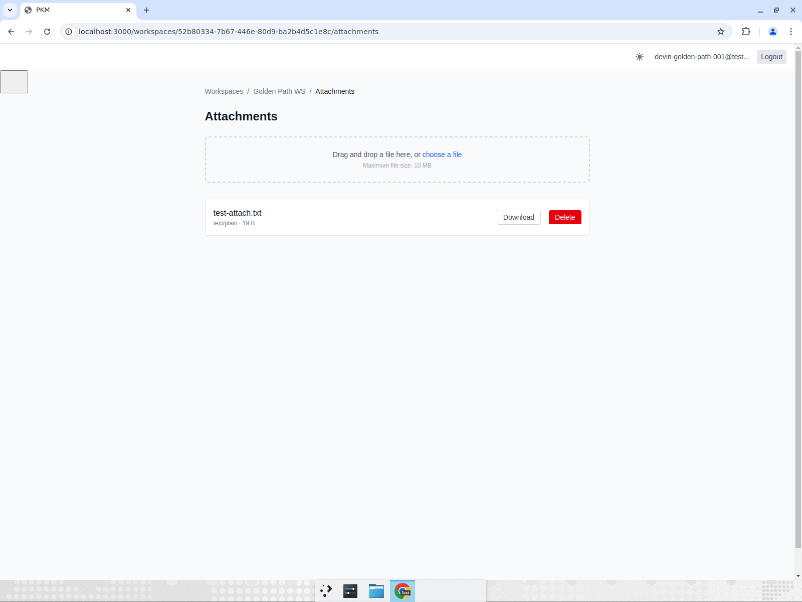 |

## Screen Recording

The full browser golden path was recorded: [golden-path-recording.mp4](test-report-assets/golden-path-recording.mp4)

## cURL / API Verification Results

All authenticated curl flows used a cookie jar and a fresh `curl-<ts>@test.local` account. Results are also saved as [curl-results.txt](test-report-assets/curl-results.txt).

```text
=== Health checks ===
{"status":"ok","version":"0.1.0"}
{"status":"ok","version":"0.1.0"}
Web HTTP 200

=== Auth: register new curl user ===
User: curl-gp-1786432206@test.local
{
  "user": {
    "id": "5b3d9326-464d-4bd0-a3af-91ca034f39c8",
    "email": "curl-gp-1786432206@test.local",
    "createdAt": "2026-08-11T07:10:06.714Z"
  }
}

=== /auth/me ===
{
  "user": {
    "id": "5b3d9326-464d-4bd0-a3af-91ca034f39c8",
    "email": "curl-gp-1786432206@test.local"
  }
}

=== Workspace creation ===
WS_ID: 83d3eaba-2569-45a7-ba49-b119e8f0a989

=== Note CRUD ===
DOC_ID: 7b0aaba8-2e45-4366-8cbd-4648555e8fc5

List documents:
"api-note.md"

Update document:
{"id":"7b0aaba8-2e45-4366-8cbd-4648555e8fc5","path":"api-note.md","updated_at":"2026-08-11T07:10:06.827Z"}

Backlinks:
[
  {
    "id": "7b0aaba8-2e45-4366-8cbd-4648555e8fc5",
    "path": "api-note.md",
    "title": "api-note"
  }
]

Index status:
{
  "document_count": 1,
  "indexed_document_count": 1,
  "current_document_count": 1,
  "stale_document_count": 0,
  "chunk_count": 2,
  "embedded_chunk_count": 2
}

Search q=cat:
"api-note.md"

Search q=animals:
"api-note.md"

=== OKF export ===
"0.2"
"Curl WS"
1

=== OKF import ===
{
  "imported": 1,
  "concepts": [
    {
      "id": "357aed25-34c7-4497-8dac-26a9801f44f4",
      "workspace_id": "83d3eaba-2569-45a7-ba49-b119e8f0a989",
      "path": "okf-test.md",
      "title": "okf-test",
      "content": "---\ntype: Note\n---\n\nLink to [API note](api-note.md).",
      "frontmatter": {
        "type": "Note"
      },
      "content_hash": "87a566969ab6c8328d96c1734d9c98f9a150e5a483d0b74aa05e20e92c6d2769",
      "created_at": "2026-08-11T07:10:06.946Z",
      "updated_at": "2026-08-11T07:10:06.946Z"
    }
  ]
}

List after OKF import:
"api-note.md"
"okf-test.md"

=== Attachment upload/download ===
ATTACH_ID: 52271041-5487-4920-be4e-ed0b87341e78
attachment diff OK

=== Delete note ===
1
```

## Blockers / Issues Encountered

1. **Missing `sentence-transformers` in the pre-existing AI `.venv`**
   - Symptom: AI service returned `503` on the first embedding request.
   - Resolution: Installed `sentence-transformers` and restarted the AI service with `EMBEDDING_PROVIDER=sentence-transformers`.
   - After fix: embeddings succeeded (`384-dim all-MiniLM-L6-v2`), index status showed `6 chunks, 6 embedded`.
   - Suggested follow-up: ensure the environment blueprint rebuilds or validates the AI `.venv` against `apps/ai/requirements.txt` and starts uvicorn with `EMBEDDING_PROVIDER=sentence-transformers`.

2. **Next.js dev overlay intercepted clicks during automation**
   - Symptom: Initial programmatic clicks on “New note”, “Create”, etc. did not register because the overlay captured pointer events.
   - Resolution: Removed the overlay element via browser console and used focused input typing for reliable modal/form interaction.
   - Note: This only affects automated testing; manual browser usage works normally.

3. **Chrome `Ctrl+K` captured by the omnibox**
   - Symptom: The first attempt to open the in-app search palette with `Ctrl+K` focused the address bar.
   - Resolution: Defocused the address bar and re-triggered the in-app shortcut.
   - Note: This only affects automated testing; manual browser usage works normally.

## Observations

- Semantic search returned conceptually related notes (`cat` returned `cats.md` and also `dogs.md`/`animals.md`).
- Wikilink import/export round-tripped correctly: `[[animals]]` was stored as standard Markdown `[Birds are animals](animals.md)` and exported back as `[[animals]]`.
- Attachments uploaded to MinIO and downloaded with identical bytes.
- Workspace isolation was implicit: all created content was scoped to the newly created workspace.

## Recommendations

1. Update the local environment blueprint to validate/rebuild `apps/ai/.venv` so `sentence-transformers` is present and start the AI service with `EMBEDDING_PROVIDER=sentence-transformers`.
2. Consider documenting the Next.js dev-overlay behavior for automated UI tests in `.devin/skills/testing-pkm/SKILL.md`.
3. Merge `devin/pkm-v1-search-ai` once the above environment setup is confirmed reproducible.
